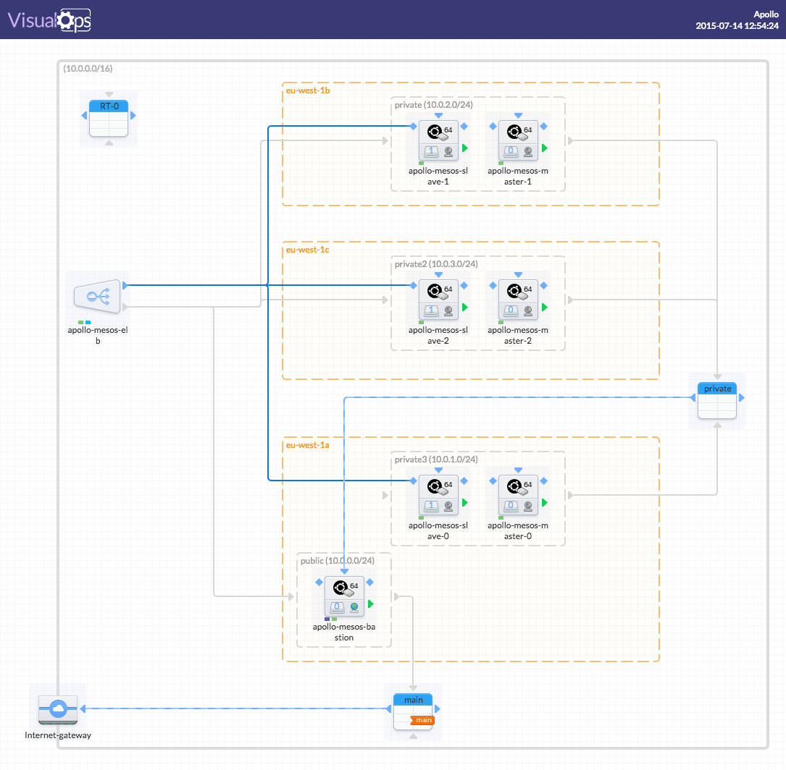

Apollo
=========

Apollo is an open source project to aid with building and deploying IAAS and
PAAS services. It is particularly geared towards managing containerized applications
across multiple hosts, and big data type workloads. Apollo leverages other
open source components to provide basic mehanisms for deployment, maintenance,
and scaling of infrastructure and applications.

Apollo is built on top of the following components:

* [Packer](https://packer.io) for automating the build of the base images
* [Terraform](https://www.terraform.io/) for provisioning the infrastructure
* [Apache Mesos](http://mesos.apache.org/) for cluster management, scheduling and resource isolation
* [Consul](http://consul.io) for service discovery, DNS
* [Docker](http://docker.io) for application container runtimes
* [Weave](https://github.com/zettio/weave) for networking of docker containers

Apollo is:

* **highly-available**: multi-datacenter
* **fault-tolerant**: Mesos / Consul master quorum with data replication
* **portable**: public, private, hybrid, multi cloud

Apollo can run anywhere!

However, initial development is primarily happening on AWS so most of our instructions and scripts are built around that. Stayed tuned for more cloud provider support! If you make it work on other infrastructure please let us know and contribute instructions/code.

Apollo is in alpha!

While the concepts and base architectural components of Apollo are not expected to change drastically, the project is still under heavy development. Expect bugs, design and API changes as we bring it to a stable, production ready, multi-cloud available product.

## Architecture

## Documentation
 - **Getting Started Guides**
    - for people who want to create an Apollo cluster
    - in [docs/getting-started-guides](docs/getting-started-guides)
 - **Demonstrators and Examples**
    - Coming soon...
 - **[Roadmap](docs/roadmap)**
 - **Components**
    - for people who want to know more about the individual components and the
    decisions behind selecting them
    - in [docs/components](docs/components)
