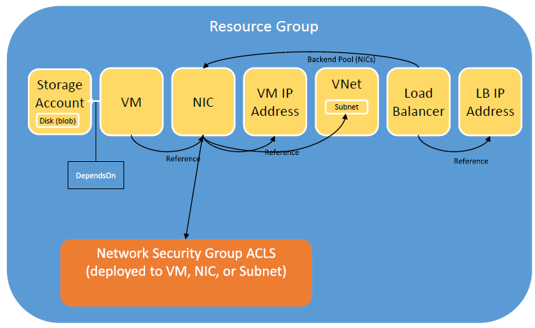

### Azure Resource Manager terraform configuration
---------------------------------------------------

This folder contains the terraform configuration for a public and private infrastructure provisioned in Azure and is created by attempting to reverse engineering and match the existing AWS architecture, https://github.com/Capgemini/Apollo/tree/master/terraform/aws.

The configuration is based on Terraform's ARM provider found here, https://www.terraform.io/docs/providers/azurerm/index.html.
Before Terrafom can create infrastructure within your Azure subscription the following information is required by the 'provider.tf' file including, subscription id, client id, client secret, tenant id. To set up oAuth authentication follow this guide https://www.terraform.io/docs/providers/azurerm/index.html.  

Connection to the server instances is via ssh authenticated by a public / private key certificate in openssh format. Putty was used to generate the public / private key files. There was an issue with certificate only authentication **so please use Terraform verion v0.6.16 or higher**.

The infrastructure is configured inline with the ARM architecture as shown in the diagram below. Terraform does not yet support creating Load Balance resources thus it was not possible to replicate this feature from AWS.

